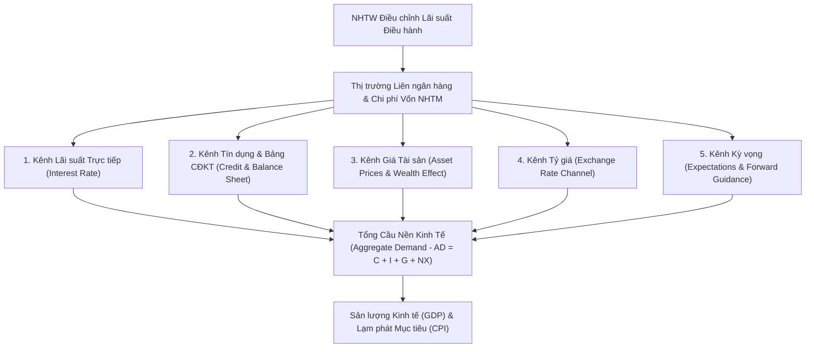

# Lãi suất Điều hành và Các Kênh Truyền dẫn Chính sách Tiền tệ
*(Policy Interest Rates and Monetary Policy Transmission Channels)*

---

## 1. Chủ đề hôm nay

* **Tên tiếng Việt:** Lãi suất Điều hành và Các Kênh Truyền dẫn Chính sách Tiền tệ.
* **Thuật ngữ tiếng Anh:** Policy Interest Rates and Monetary Policy Transmission Channels.
* **Mã định danh bài học:** `MONEY-002` (Nhánh `monetary-and-banking`).
* **Kiến thức liên kết hạt nhân:** Nối tiếp kiến thức về **Cung tiền $M1, M2$** ([`MONEY-001`](money-supply-and-bank-money-creation.md)) và **Lạm phát vĩ mô** ([`MACRO-001`](../macroeconomics/inflation-cpi-and-macro-transmission.md)) để hoàn thiện tam giác nền tảng vĩ mô: **Cung tiền – Lạm phát – Lãi suất**.

---

## 2. Vấn đề cốt lõi

Mỗi khi Ngân hàng Trung ương (NHTW) – như Cục Dự trữ Liên bang Mỹ (Fed) hay Ngân hàng Nhà nước Việt Nam (NHNN) – ra quyết định điều chỉnh lãi suất thêm $0{,}25\%$ hay $0{,}5\%$, sự kiện này ngay lập tức chiếm lĩnh trang nhất của mọi thời báo tài chính toàn cầu.

Tuy nhiên, có một câu hỏi nền tảng mà nhiều người bỏ qua:
> **NHTW không trực tiếp cho người dân hay doanh nghiệp thông thường vay tiền, vậy bằng cách nào một quyết định thay đổi lãi suất tại phòng họp của NHTW lại có thể làm rung chuyển thị trường chứng khoán, thay đổi số tiền trả góp mua nhà hàng tháng của bạn, định đoạt tỷ giá hối đoái và làm chậm lại hoặc thúc đẩy tăng trưởng của cả nền kinh tế?**

Bài học này sẽ bóc tách chi tiết hệ thống "bánh răng truyền động" (Kênh truyền dẫn chính sách tiền tệ - *Transmission Channels*), phân tích cơ chế can thiệp thanh khoản trên bảng cân đối kế toán của hệ thống ngân hàng, và chỉ ra cách một nhà đầu tư hay cá nhân có thể dự phóng tác động của chu kỳ lãi suất đến tài sản của mình.

---

## 3. Giải thích cơ chế

### 3.1. Bản chất của Lãi suất Điều hành: NHTW thực sự kiểm soát cái gì?

`[Definition]` **Lãi suất điều hành (Policy Interest Rate)** là mức lãi suất chuẩn do NHTW thiết lập nhằm điều tiết chi phí vốn ngắn hạn trên thị trường liên ngân hàng (*Interbank Market*), qua đó gián tiếp định hướng lãi suất huy động, lãi suất cho vay và lượng thanh khoản của toàn bộ nền kinh tế.

Trong nền kinh tế thị trường hiện đại, NHTW **không ấn định trực tiếp** lãi suất cho vay của từng hợp đồng giữa NHTM và khách hàng cá nhân/doanh nghiệp. Thay vào đó, NHTW kiểm soát **chi phí thanh khoản bán buôn** (Wholesale Liquidity Cost) mà các NHTM phải trả để vay mượn dự trữ lẫn nhau hoặc vay từ NHTW.

```
       [ Ngân hàng Trung ương (NHTW) ]
                      │
   (Điều tiết Lãi suất Điều hành & Nghiệp vụ OMO)
                      ▼
       [ Thị trường Liên ngân hàng (Interbank) ]
         (Chi phí vay mượn vốn dự trữ qua đêm)
                      │
     ┌────────────────┴────────────────┐
     ▼                                 ▼
[ Lãi suất Huy động ]          [ Lãi suất Cho vay ]
 (Trả cho người gửi tiền)      (Thu từ Doanh nghiệp / Cá nhân)
     │                                 │
     └────────────────┬────────────────┘
                      ▼
       [ Toàn bộ Nền kinh tế Thực ]
   (Tiêu dùng, Đầu tư, Giá tài sản, Tỷ giá, Việc làm)
```

#### Khung hành lang Lãi suất (Corridor / Channel System)
Để giữ lãi suất thị trường liên ngân hàng vận hành quanh mục tiêu, các NHTW thường thiết lập một **Hành lang Lãi suất (Interest Rate Corridor)** gồm 3 mức:

1. **Lãi suất Trần (Ceiling Rate - Lãi suất Tái cấp vốn / Discount Rate):** Mức lãi suất NHTW cho các ngân hàng thương mại vay khi họ thiếu hụt thanh khoản khẩn cấp. Không ngân hàng nào đi vay liên ngân hàng với lãi suất cao hơn mức trần này (vì họ luôn có thể vay trực tiếp từ NHTW).
2. **Lãi suất Sàn (Floor Rate - Lãi suất Tiền gửi Dự trữ / IORB / Reverse Repo Rate):** Mức lãi suất NHTW trả cho tiền dự trữ mà các ngân hàng thương mại gửi tại NHTW. Không ngân hàng nào chấp nhận cho ngân hàng khác vay trên thị trường liên ngân hàng với lãi suất thấp hơn mức sàn này (vì gửi tại NHTW vừa an toàn tuyệt đối vừa được hưởng lãi suất sàn).
3. **Lãi suất Mục tiêu Trung tâm (Target Policy Rate / OMO Rate):** Lãi suất mục tiêu mà NHTW muốn thị trường liên ngân hàng giao dịch, thường được can thiệp thông qua **Nghiệp vụ Thị trường Mở (Open Market Operations - OMO)**.

---

### 3.2. Cấu trúc Lãi suất Điều hành tại Việt Nam (NHNN Framework)

`[Current Fact]` Tại Việt Nam, Ngân hàng Nhà nước (NHNN) điều hành chính sách tiền tệ thông qua một tổ hợp công cụ lãi suất và chỉ tiêu định lượng đặc thù:

| Công cụ Lãi suất | Tên tiếng Anh | Vai trò & Bản chất Thể chế |
| :--- | :--- | :--- |
| **Lãi suất Tái cấp vốn** | Refinancing Rate | Lãi suất NHNN áp dụng khi cho các NHTM vay có bảo đảm bằng giấy tờ có giá (đóng vai trò chặn trên cho chi phí thanh khoản dài hạn hơn). |
| **Lãi suất Tái chiết khấu** | Rediscount Rate | Lãi suất áp dụng khi NHNN mua lại các công cụ nợ ngắn hạn (thương phiếu, trái phiếu) chưa đến hạn của NHTM. |
| **Lãi suất OMO (Repo/Tín phiếu)** | OMO Rate | Lãi suất đấu thầu giấy tờ có giá (mua kỳ hạn bơm thanh khoản hoặc bán tín phiếu hút thanh khoản) trên thị trường mở. Đây là lãi suất can thiệp trực tiếp nhất đến thanh khoản ngắn hạn. |
| **Trần Lãi suất Tiền gửi ngắn hạn** | Deposit Rate Cap | Quy định mức lãi suất huy động tối đa cho tiền gửi không kỳ hạn và có kỳ hạn dưới 6 tháng bằng VND. |

---

### 3.3. Hạch toán Bảng Cân đối Kế toán khi NHTW Can thiệp Thanh khoản (Rule G-002)

Để hiểu rõ tại sao lãi suất thay đổi làm thay đổi thanh khoản, ta cần nhìn vào **Bảng Cân đối Kế toán** của NHTW và Hệ thống NHTM:

`[Accounting Identity]` **Trường hợp 1: NHTW thực hiện nghiệp vụ OMO Mua kỳ hạn (Repo - Bơm thanh khoản)**
* NHTW mua 10.000 tỷ đồng Trái phiếu Chính phủ từ Ngân hàng Thương mại A (kèm cam kết bán lại sau 7 ngày với lãi suất $r_{OMO}$).

```text
BẢNG CÂN ĐỐI KẾ TOÁN NHTW:
  Tài sản (Assets):            +10.000 tỷ [Trái phiếu Repo]
  Nguồn vốn (Liabilities):     +10.000 tỷ [Dự trữ của NHTM A tại NHTW]

BẢNG CÂN ĐỐI KẾ TOÁN NHTM A:
  Tài sản (Assets):            -10.000 tỷ [Trái phiếu Chính phủ giữ trong kho]
                               +10.000 tỷ [Tiền Dự trữ gửi tại NHTW]
  Nguồn vốn (Liabilities):     Không đổi (0)
```

> ⚠️ **LƯU Ý CỐT LÕI (Rule G-002):** 
> Giao dịch này làm tăng **Tiền dự trữ liên ngân hàng ($R$)**, không làm tăng ngay lập tức **Tiền gửi khách hàng ($D$)**. Thanh khoản hệ thống ngân hàng dồi dào hơn $\rightarrow$ Lãi suất liên ngân hàng hạ nhiệt $\rightarrow$ NHTM A có chi phí vốn rẻ hơn để sẵn sàng giải ngân cho vay ra nền kinh tế thực.

---

### 3.4. Năm Kênh Truyền dẫn Chính sách Tiền tệ (5 Transmission Channels)

Khi NHTW thay đổi lãi suất điều hành, quyết định này lan tỏa vào nền kinh tế thực thông qua **5 kênh truyền dẫn độc lập nhưng tương hỗ lẫn nhau**:



#### 1. Kênh Lãi suất Trực tiếp (Traditional Interest Rate Channel)
`[Causal Mechanism]`
* **Cơ chế:** Lãi suất điều hành tăng $\rightarrow$ Lãi suất huy động và cho vay của NHTM tăng $\rightarrow$ **Chi phí cơ hội của việc tiêu dùng tăng** (người dân muốn gửi tiết kiệm hơn chi tiêu) và **Chi phí vốn vay của doanh nghiệp tăng** ($Cost\ of\ Capital \uparrow$).
* **Hệ quả kinh tế:** 
  $$\text{Đầu tư Doanh nghiệp } (I) \downarrow \quad \text{và} \quad \text{Tiêu dùng Cá nhân } (C) \downarrow \quad \Longrightarrow \quad \text{Tổng cầu } (AD) \downarrow \quad \Longrightarrow \quad \text{Lạm phát } (\pi) \downarrow$$
* **Định giá tài chính:** Dòng tiền tương lai bị chiết khấu với lãi suất $r$ cao hơn theo công thức Hiện giá Thuần:
  $$\text{NPV} = \sum_{t=1}^{n} \frac{CF_t}{(1 + r)^t} - C_0$$
  Khi $r$ tăng, nhiều dự án mở rộng nhà máy của doanh nghiệp từ mức "có lãi" (NPV > 0) chuyển thành "lỗ hoặc không hiệu quả" (NPV < 0) $\rightarrow$ Doanh nghiệp hủy kế hoạch đầu tư và ngừng mở rộng nhân sự.

#### 2. Kênh Tín dụng & Bảng cân đối kế toán (Credit & Balance Sheet Channel)
`[Causal Mechanism]`
* **Bank Lending Channel (Kênh cung ứng tín dụng):** Khi NHTW thắt chặt tiền tệ, lượng tiền dự trữ trong hệ thống co lại, chi phí thanh khoản tăng. Các ngân hàng thương mại không chỉ tăng lãi suất mà còn **thắt chặt tiêu chuẩn cho vay** (Credit Standards) do lo ngại rủi ro nợ xấu.
* **Balance Sheet Channel (Kênh tài sản đảm bảo):** Khi lãi suất tăng, giá trị tài sản đảm bảo của bên đi vay (bất động sản, cổ phiếu) giảm giá trị. Bảng cân đối kế toán của doanh nghiệp xấu đi (Tỷ lệ đòn bẩy $D/E$ tăng, hệ số trả lãi $ICR = \frac{EBIT}{I}$ giảm) $\rightarrow$ Ngân hàng đánh giá rủi ro vỡ nợ tăng lên $\rightarrow$ Cắt giảm hạn mức tín dụng của doanh nghiệp.

#### 3. Kênh Giá Tài sản & Hiệu ứng Của cải (Asset Price Channel & Wealth Effect)
`[Causal Mechanism]`
* **Định giá Cổ phiếu & BĐS:** Theo mô hình chiết khấu cổ tức Gordon hoặc dòng tiền $DCF$:
  $$P_0 = \frac{D_1}{r - g}$$
  Khi lãi suất phi rủi ro tăng, tỷ suất sinh lời đòi hỏi ($r$) tăng lên. Đồng thời, do kinh tế chậm lại, tốc độ tăng trưởng kỳ vọng ($g$) giảm sút. Cả hai yếu tố này cùng kéo giá cổ phiếu và bất động sản sụt giảm mạnh.
* **Hiệu ứng Của cải (Wealth Effect):** Khi giá trị danh mục cổ phiếu và giá nhà đất giảm, các hộ gia đình cảm thấy mình "nghèo đi" về mặt tài sản ròng, ngay cả khi thu nhập từ lương chưa đổi. Họ chủ động cắt giảm các khoản chi tiêu tùy ý (du lịch, mua sắm đồ xa xỉ, đổi xe mới).

#### 4. Kênh Tỷ giá (Exchange Rate Channel)
`[Causal Mechanism]`
* **Cơ chế chênh lệch lãi suất (Interest Rate Parity):** Khi NHTW quốc gia A tăng lãi suất trong khi các nước khác giữ nguyên, chênh lệch lợi suất $\Delta i = i_{A} - i_{thế giới}$ mở rộng.
* **Dòng vốn danh mục:** Dòng vốn ngoại tệ (FII, tiền gửi ngắn hạn) có xu hướng chảy vào quốc gia A để tìm kiếm lợi suất cao hơn $\rightarrow$ Cầu đồng nội tệ tăng $\rightarrow$ **Đồng nội tệ tăng giá (Appreciation)**.
* **Tác động thương mại & Lạm phát:**
  - Đồng nội tệ mạnh làm hàng nhập khẩu (xăng dầu, nguyên vật liệu) rẻ hơn $\rightarrow$ **Hạ nhiệt lạm phát nhập khẩu** (*Imported Inflation*).
  - Ngược lại, hàng xuất khẩu của quốc gia A trở nên đắt đỏ hơn đối với người nước ngoài $\rightarrow$ Xuất khẩu ròng ($NX = X - M$) sụt giảm $\rightarrow$ Tổng cầu $AD \downarrow$.

#### 5. Kênh Kỳ vọng & Định hướng Tương lai (Expectations Channel & Forward Guidance)
`[Causal Mechanism]`
* **Tâm lý tự ứng nghiệm:** Nếu NHTW có uy tín cao (*Credibility*) và đưa ra thông điệp kiên quyết chống lạm phát, các doanh nghiệp sẽ ngần ngại tăng giá bán hàng loạt (vì sợ mất khách hàng trong tương lai), người lao động bớt yêu cầu tăng lương bù lạm phát quá mức.
* **Kỳ vọng lạm phát neo vững (Anchored Inflation Expectations):** Kênh kỳ vọng giúp hạ nhiệt lạm phát ngay từ trong tâm lý thị trường trước khi các kênh tín dụng và lãi suất kịp phát huy toàn bộ tác dụng cơ học.

---

## 4. Ví dụ trực quan

Để thấy sức tàn phá hoặc lực kích thích của lãi suất điều hành, hãy xem xét trường hợp cụ thể: **NHTW tăng lãi suất điều hành thêm 1,5% (150 điểm cơ bản - bps)**.

```
                  ┌───────────────────────────────────────────────────────────┐
                  │ NHTW Tăng Lãi suất Điều hành thêm +1,50% (150 bps)        │
                  └─────────────────────────────┬─────────────────────────────┘
                                                │
                 ┌──────────────────────────────┴─────────────────────────────┐
                 ▼                                                            ▼
┌─────────────────────────────────────────┐  ┌──────────────────────────────────────────┐
│ DOANH NGHIỆP MINH PHÁT (Sản xuất bao bì)│  │ HỘ GIA ĐÌNH ANH TUẤN (Vay mua căn hộ)   │
├─────────────────────────────────────────┤  ├──────────────────────────────────────────┤
│ • Dư nợ vay ngân hàng: 50 tỷ VND       │  │ • Dư nợ vay mua nhà: 2 tỷ VND (thả nổi) │
│ • Lãi suất vay: 9%/năm ➔ 11%/năm (+2%)  │  │ • Lãi suất vay: 8,5%/năm ➔ 11%/năm      │
│ • Chi phí lãi vay tăng thêm:            │  │ • Tiền trả góp hàng tháng (gốc + lãi):   │
│   50 tỷ × 2% = 1,0 tỷ VND/năm           │  │   21,5 triệu ➔ 25,2 triệu VND (+3,7 tr)  │
│ • Lợi nhuận trước thuế giảm từ:         │  │ • Tỷ lệ nợ/thu nhập (DTI):               │
│   4,0 tỷ ➔ 3,0 tỷ VND (-25%)            │  │   35% ➔ 42% thu nhập gia đình            │
│ ➔ Hủy kế hoạch mua dây chuyền mới 20 tỷ │  │ ➔ Cắt giảm ăn ngoài, hủy chuyến du lịch  │
│ ➔ Đóng băng tuyển dụng 15 công nhân mới │  │ ➔ Gửi tiết kiệm 100 tr nhàn rỗi (lãi 7%) │
└─────────────────────────────────────────┘  └──────────────────────────────────────────┘
```

### Phân tích Tác động Tổng hợp:
1. **Ở cấp độ Vi mô:** Cả doanh nghiệp Minh Phát và gia đình anh Tuấn đều đồng thời **cắt giảm chi tiêu và đầu tư**.
2. **Ở cấp độ Vĩ mô:** Khi hàng triệu doanh nghiệp và hộ gia đình cùng hành động như vậy, tổng cầu $AD$ của toàn bộ nền kinh tế co lại. Doanh số của các nhà hàng, đại lý du lịch, nhà máy bán máy móc thiết bị đều sụt giảm. Khi sức mua yếu đi, các nhà bán lẻ không dám tiếp tục tăng giá hàng hóa $\rightarrow$ **Lạm phát bị chặn đứng và bắt đầu hạ nhiệt**.

---

## 5. Tình huống thực tế: Chu kỳ Siết chặt Tiền tệ Lịch sử 2022–2023 & Phản ứng của Việt Nam

`[Historical Claim]` Trong giai đoạn 2022–2023, thế giới chứng kiến chu kỳ thắt chặt tiền tệ nhanh và quyết liệt nhất trong hơn 4 thập kỷ của Cục Dự trữ Liên bang Mỹ (Fed) nhằm kiểm soát lạm phát đạt đỉnh $9{,}1\%$:

* **Hành động của Fed:** Nâng lãi suất quỹ liên bang (*Fed Funds Rate*) từ mức gần $0\%$ (tháng 3/2022) lên dải $5{,}25\% - 5{,}50\%$ (tháng 7/2023), tức tăng hơn 500 điểm cơ bản trong vòng 16 tháng.
* **Tác động qua Kênh Tỷ giá toàn cầu:** Chỉ số sức mạnh đồng USD ($DXY$) tăng vọt từ mốc 95 điểm lên trên 114 điểm. Hầu hết các đồng tiền trên thế giới chịu áp lực mất giá nghiêm trọng.

```
       [ Fed tăng lãi suất lên 5,25% - 5,50% ]
                          │
          (Chênh lệch lãi suất USD - VND mở rộng)
                          ▼
       [ Áp lực Rút vốn & Tỷ giá USD/VND căng thẳng ]
                          │
       ┌──────────────────┴──────────────────┐
       ▼                                     ▼
[ Giai đoạn 1 (Cuối 2022): Ổn định Tỷ giá ] [ Giai đoạn 2 (Đầu 2023): Hỗ trợ Kinh tế ]
• NHNN tăng lãi suất điều hành 2 lần (+200 bps) • Lạm phát trong nước được kiểm soát (~3,2%)
• Bán dự trữ ngoại hối can thiệp                • Kinh tế đối mặt suy giảm xuất khẩu & BĐS
• Lãi suất huy động VND có lúc vượt 9-10%       • NHNN đi ngược thế giới: 4 lần giảm lãi suất
• Chi phí vốn tăng, thị trường BĐS đóng băng    • Lãi suất điều hành hạ 150-200 bps để trợ lực
```

### Bài học Cơ chế từ Thực tế Việt Nam:
1. **Bài toán "Bộ ba Bất khả thi" (Impossible Trinity):** Việt Nam duy trì kiểm soát dòng vốn có quản lý, điều hành tỷ giá ổn định linh hoạt và chủ động chính sách tiền tệ. Khi Fed tăng lãi suất quá gắt, NHNN buộc phải cân bằng giữa hai mục tiêu: **Ổn định tỷ giá / Kiểm soát lạm phát** và **Hỗ trợ thanh khoản / Tăng trưởng kinh tế**.
2. **Sự phân kỳ chính sách (Policy Divergence):** Đầu năm 2023, khi lạm phát trong nước duy trì ở mức an toàn nhưng các doanh nghiệp kiệt quệ dòng tiền sau sự cố thị trường trái phiếu doanh nghiệp, NHNN đã quyết định **hạ lãi suất điều hành 4 lần liên tiếp** dù Fed vẫn đang trong quá trình tăng lãi suất. Điều này cho thấy lãi suất điều hành luôn phải linh hoạt thích ứng với cấu trúc chu kỳ kinh tế nội tại chứ không sao chép máy móc theo quốc tế.

---

## 6. Hiểu lầm phổ biến

### ❌ Hiểu lầm 1: "NHTW tăng lãi suất điều hành thì ngày mai toàn bộ lãi suất vay ngân hàng thương mại đều tăng theo đúng tỷ lệ đó."
* **Thực tế:** Cơ chế truyền dẫn từ lãi suất điều hành sang lãi suất bán lẻ có **độ trễ lớn (Transmission Lag)** và **mức độ hấp thụ không hoàn hảo**. 
  - Các hợp đồng vay cũ thường có kỳ hạn cố định hoặc chu kỳ điều chỉnh lãi suất 3 tháng/6 tháng một lần.
  - Ngân hàng thương mại tính lãi suất cho vay dựa trên **Chi phí Vốn bình quân (Cost of Funds - CoF)** cộng biên độ lợi nhuận ròng (*NIM*). Nếu thanh khoản trong hệ thống dồi dào hoặc cạnh tranh cho vay gay gắt, NHTM có thể chấp nhận giảm biên NIM thay vì tăng toàn bộ lãi suất cho vay theo NHTW.

### ❌ Hiểu lầm 2: "Hạ lãi suất về mức rất thấp chắc chắn sẽ khiến tín dụng tăng vọt và kinh tế bùng nổ ngay."
* **Thực tế:** `[Theoretical Model vs Real Mechanism]` Đây là sai lầm kinh điển bỏ qua hành vi của người đi vay và bên cho vay:
  - **Từ phía người vay:** Nếu triển vọng kinh doanh ảm đạm, người dân sợ mất việc, doanh nghiệp không có đơn hàng thì dù lãi suất có giảm về 3–4%, họ cũng **không dám vay thêm** (hiện tượng suy giảm cầu tín dụng tự nhiên).
  - **Từ phía ngân hàng:** Trong giai đoạn suy thoái, rủi ro nợ xấu tăng cao, ngân hàng thà đem tiền dư thừa gửi tại NHTW hoặc mua Trái phiếu Chính phủ an toàn chứ không dám hạ chuẩn để giải ngân cho các doanh nghiệp yếu kém.
  - Khi lãi suất chạm sàn mà nền kinh tế vẫn đình trệ, chính sách tiền tệ rơi vào **Bẫy Thanh khoản (Liquidity Trap)** hoặc **Hiện tượng Đẩy sợi dây (Pushing on a string)** – bạn có thể kéo dây lại (thắt chặt tiền tệ rất hiệu quả), nhưng không thể lấy sợi dây để đẩy đồ vật về phía trước (hạ lãi suất không ép được người ta vay nếu thiếu niềm tin).

### ❌ Hiểu lầm 3: "Lãi suất điều hành chỉ ảnh hưởng đến những người có nợ vay ngân hàng."
* **Thực tế:** Lãi suất là "trọng lực" của toàn bộ thế giới tài chính. Ngay cả khi bạn không nợ một đồng nào và không có tiền gửi tiết kiệm:
  - Lãi suất tăng làm giảm định giá cổ phiếu của công ty bạn đang làm việc.
  - Lãi suất tăng làm công ty cắt giảm ngân sách tuyển dụng và thưởng Tết.
  - Lãi suất làm thay đổi tỷ giá, khiến giá chiếc điện thoại nhập khẩu hay hộp sữa ngoại bạn mua hàng ngày tăng giá.

---

## 7. So sánh Mô hình Giáo trình vs Cơ chế Vận hành Thực tế (Rule G-001)

| Tiêu chí | Mô hình Giáo trình (Textbook Model) | Cơ chế Thực tế Thể chế (Real-World Mechanism) |
| :--- | :--- | :--- |
| **Quy tắc Ra quyết định** | **Quy tắc Taylor (Taylor Rule):** $i_t = r^* + \pi_t + 0{,}5(\pi_t - \pi^*) + 0{,}5(y_t - y^*)$. Giả định NHTW phản ứng máy móc theo độ lệch lạm phát và sản lượng. | NHTW ra quyết định dựa trên tổ hợp dữ liệu phức tạp: Thị trường lao động, áp lực tỷ giá, độ an toàn của hệ thống ngân hàng, rủi ro địa chính trị và sự ổn định của thị trường tài sản. |
| **Kênh Truyền dẫn** | Truyền dẫn hoàn hảo, tức thì và tuyến tính qua kênh lãi suất thuần túy. | Truyền dẫn có **độ trễ dài và biến thiên (Long and Variable Lags)** từ 6 đến 24 tháng; gặp nhiều rào cản ma sát (nợ xấu, trần tín dụng, tâm lý thị trường). |
| **Cơ chế Khống chế** | NHTW chỉ cần chỉnh lãi suất mục tiêu, thị trường tự động cân bằng cung cầu tiền tệ. | Tại nhiều quốc gia đang phát triển (như Việt Nam), NHTW phải kết hợp lãi suất với **Hạn mức Tăng trưởng Tín dụng (Credit Quota / Room tín dụng)** và can thiệp thị trường ngoại hối. |
| **Tính Đối xứng** | Tăng lãi suất và giảm lãi suất có hiệu lực tương đương nhau về mặt độ lớn. | **Bất đối xứng sâu sắc:** Tăng lãi suất (dập tắt thanh khoản) có tác động nhanh và mạnh như "đạp phanh gấp"; trong khi Giảm lãi suất (bơm tiền kích cầu) phụ thuộc hoàn toàn vào niềm tin của doanh nghiệp và người tiêu dùng. |

---

## 8. Kiến thức này có ích gì với tôi?

Hiểu rõ cơ chế lãi suất điều hành và các kênh truyền dẫn giúp bạn chuyển từ thế **bị động hứng chịu biến động kinh tế** sang thế **chủ động phòng ngừa rủi ro và quản trị danh mục**:

```
                       ┌─────────────────────────────────────────────────────────┐
                       │ BẢN ĐỒ CHIẾN LƯỢC QUẢN TRỊ TÀI CHÍNH THEO CHU KỲ LÃI SUẤT│
                       └────────────────────────────┬────────────────────────────┘
                                                    │
                 ┌──────────────────────────────────┴──────────────────────────────────┐
                 ▼                                                                     ▼
┌─────────────────────────────────────────────────┐   ┌─────────────────────────────────────────────────┐
│     GIAI ĐOẠN LÃI SUẤT TĂNG (Thắt chặt Tiền tệ) │   │       GIAI ĐOẠN LÃI SUẤT GIẢM (Nới lỏng Tiền tệ)│
├─────────────────────────────────────────────────┤   ├─────────────────────────────────────────────────┤
│ 1. Quản trị Nợ Vay:                             │   │ 1. Quản trị Nợ Vay:                             │
│    • Ưu tiên tất toán các khoản nợ thả nổi      │   │    • Cân nhắc đòn bẩy hợp lý để mở rộng sản xuất│
│      lãi suất cao (thẻ tín dụng, tiêu dùng).    │   │      kinh doanh hoặc đầu tư tài sản sinh dòng tiền.│
│    • Đàm phán chốt lãi suất cố định dài hạn nếu │   │    • Tận dụng các gói vay ưu đãi lãi suất cố    │
│      có các khoản vay mua nhà trung-dài hạn.    │   │      định 1-2 năm đầu.                          │
│                                                 │   │                                                 │
│ 2. Phân bổ Tài sản (Asset Allocation):          │   │ 2. Phân bổ Tài sản (Asset Allocation):          │
│    • Tăng tỷ trọng Tiền gửi tiết kiệm kỳ hạn    │   │    • Giảm tỷ trọng tiền mặt/tiết kiệm lãi suất thấp.│
│      ngắn để tái tục với lãi suất cao hơn.      │   │    • Tăng tỷ trọng Cổ phiếu tăng trưởng và Bất  │
│    • Hạn chế nắm giữ tài sản đầu cơ sử dụng đòn │   │      động sản có pháp lý hoàn thiện và dòng     │
│      bẩy lớn (BĐS vùng ven, cổ phiếu rác).      │   │      tiền khai thác thực tế.                    │
│    • Chiết khấu định giá cổ phiếu khắt khe hơn. │   │    • Nắm giữ Trái phiếu để hưởng tăng giá vốn.  │
│                                                 │   │                                                 │
│ 3. Sự nghiệp & Doanh nghiệp Cá nhân:            │   │ 3. Sự nghiệp & Doanh nghiệp Cá nhân:            │
│    • Giữ vùng đệm thanh khoản khẩn cấp lớn hơn  │   │    • Nắm bắt cơ hội mở rộng kinh doanh, đàm     │
│      (6-12 tháng chi phí sinh hoạt).            │   │      phán thuê mặt bằng giá tốt trước khi chu   │
│    • Cẩn trọng khi nhảy việc sang các startup   │   │      kỳ tăng trưởng nóng quay trở lại.          │
│      phụ thuộc dòng vốn đầu tư mạo hiểm (VC).   │   │                                                 │
└─────────────────────────────────────────────────┘   └─────────────────────────────────────────────────┘
```

---

## 9. Bảng thuật ngữ & Liên kết kiến thức

### 🔤 Bảng Thuật ngữ (Glossary)

| Thuật ngữ tiếng Việt | Thuật ngữ tiếng Anh | Định nghĩa tóm tắt |
| :--- | :--- | :--- |
| **Lãi suất Điều hành** | Policy Interest Rate | Lãi suất chuẩn do NHTW ấn định để điều tiết chi phí thanh khoản và định hướng lãi suất thị trường. |
| **Lãi suất Tái cấp vốn** | Refinancing Rate | Lãi suất NHTW cho các NHTM vay có bảo đảm bằng giấy tờ có giá. |
| **Lãi suất Tái chiết khấu** | Rediscount Rate | Lãi suất NHTW áp dụng khi chiết khấu thương phiếu và giấy tờ có giá ngắn hạn chưa đến hạn của NHTM. |
| **Nghiệp vụ Thị trường Mở** | Open Market Operations (OMO) | Hoạt động NHTW mua/bán giấy tờ có giá trên thị trường để bơm/hút tiền dự trữ của hệ thống ngân hàng. |
| **Kênh Truyền dẫn Chính sách Tiền tệ** | Monetary Policy Transmission Mechanism | Chuỗi liên kết nhân quả qua đó quyết định lãi suất của NHTW lan tỏa đến tổng cầu, sản lượng và lạm phát. |
| **Hiệu ứng Của cải** | Wealth Effect | Xu hướng thay đổi mức chi tiêu tiêu dùng của hộ gia đình khi giá trị tài sản ròng (nhà ở, chứng khoán) biến động. |
| **Định hướng Tương lai** | Forward Guidance | Công cụ truyền thông của NHTW về định hướng lãi suất tương lai nhằm định hình kỳ vọng của thị trường. |
| **Hành lang Lãi suất** | Interest Rate Corridor | Khung biên độ gồm lãi suất trần và lãi suất sàn do NHTW thiết lập để giới hạn biến động của lãi suất liên ngân hàng. |
| **Bẫy Thanh khoản** | Liquidity Trap | Trạng thái lãi suất danh nghĩa chạm mức rất thấp nhưng chính sách nới lỏng mất tác dụng do công chúng găm giữ tiền mặt. |

---

### 🔗 Liên kết Kiến thức (Knowledge Graph)

* **Bài học nền tảng đã học:**
  - [`MONEY-001`](money-supply-and-bank-money-creation.md): Cung tiền M1, M2 và Cơ chế Tạo tiền của Ngân hàng Thương mại.
  - [`MACRO-001`](../macroeconomics/inflation-cpi-and-macro-transmission.md): Lạm phát: Bản chất, Phương pháp Đo lường CPI và Các Kênh Truyền dẫn Vĩ mô.
* **Gợi mở bài học tiếp theo trong Hàng chờ (`RELATE.md`):**
  - **Hiệu ứng Fisher & Đường cong Lợi suất (Yield Curve - Inverted Yield Curve)**: Khi lãi suất ngắn hạn bị NHTW đẩy lên cao hơn lãi suất dài hạn, đường cong lợi suất đảo ngược báo hiệu suy thoái kinh tế ra sao?
  - **Tỷ giá Hối đoái & Khủng hoảng Cán cân Thanh toán (Exchange Rate & Balance of Payments)**: Cơ chế can thiệp ngoại hối và áp lực tỷ giá USD/VND.
  - **Tâm lý học Hành vi trong Chu kỳ Lãi suất (Behavioral Economics in Market Cycles)**: Bẫy tâm lý sợ bỏ lỡ (FOMO) khi lãi suất rẻ và tâm lý hoảng loạn bán tháo khi lãi suất tăng cao.
